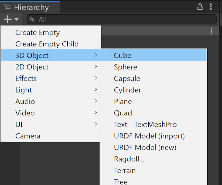
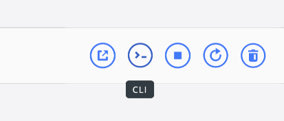

# ROS–Unity Integration: Publisher

Create a simple Unity scene which publishes a GameObject's position and rotation to a [ROS topic](http://wiki.ros.org/ROS/Tutorials/UnderstandingTopics#ROS_Topics).

These instructions cover the setup for both ROS1 and ROS2. Instructions for ROS2 users are marked with this icon: .

## Setting Up

- Follow the [ROS–Unity Demo Setup](setup.md#ros2-environment) guide.

## Create Unity Publisher
- In your Project tab in Unity, create a new C# script and name it `RosPublisherExample`. Paste the following code into the new script file.
    - (Alternatively, you can drag the script file into Unity from `tutorials/ros_unity_integration/unity_scripts/RosPublisherExample.cs` in this repo.)

```csharp
using UnityEngine;
using Unity.Robotics.ROSTCPConnector;
using RosMessageTypes.UnityRoboticsDemo;

/// <summary>
///
/// </summary>
public class RosPublisherExample : MonoBehaviour
{
    ROSConnection ros;
    public string topicName = "pos_rot";

    // The game object
    public GameObject cube;
    // Publish the cube's position and rotation every N seconds
    public float publishMessageFrequency = 0.5f;

    // Used to determine how much time has elapsed since the last message was published
    private float timeElapsed;

    void Start()
    {
        // start the ROS connection
        ros = ROSConnection.GetOrCreateInstance();
        ros.RegisterPublisher<PosRotMsg>(topicName);
    }

    private void Update()
    {
        timeElapsed += Time.deltaTime;

        if (timeElapsed > publishMessageFrequency)
        {
            cube.transform.rotation = Random.rotation;

            PosRotMsg cubePos = new PosRotMsg(
                cube.transform.position.x,
                cube.transform.position.y,
                cube.transform.position.z,
                cube.transform.rotation.x,
                cube.transform.rotation.y,
                cube.transform.rotation.z,
                cube.transform.rotation.w
            );

            // Finally send the message to server_endpoint.py running in ROS
            ros.Publish(topicName, cubePos);

            timeElapsed = 0;
        }
    }
}
```

- Add a plane and a cube to your Unity scene. You can create simple geometric shapes in Unity by going to the Hierarchy window, clicking the + button, and navigating to the shape you want to create.



- Move the cube a little ways up so it is hovering above the plane. To do this, select the cube in the hierarchy window, and click on the move tool in the toolbar at the top left of the Unity window.


- Draggable arrows will appear around the cube in the Scene view; to move the cube up, drag the vertical (green) arrow upwards.

- Create another empty GameObject, name it `RosPublisher` and attach the `RosPublisherExample` script.
    - Drag the cube GameObject onto the `Cube` parameter.

- Press play in the Editor. You should see the connection lights at the top left corner of the Game window turn blue, and something like `[INFO] [1622242057.562860400] [TCPServer]: Connection from 172.17.0.1` appear in the terminal running your server_endpoint.

## Common Errors

If you see the error `Failed to resolve message name: No module named unity_robotics_demo_msgs.msg` followed by `Topic 'pos_rot' is not registered` in the ROS-TCP-Endpoint log, you may have missed the step about installing the unity_robotics_demo_msgs package, or perhaps you forgot to build and/or source it afterwards. Try following the "Install Unity Robotics Demo" instructions [here](setup.md#install-unity-robotics-demo).

## Start the Echo monitor

- To prove that messages are actually being received by ROS, let's run the rostopic echo command.

	a)  In ROS1, open a new terminal window, navigate to your ROS workspace, and run the following commands:

    ```bash
    source devel/setup.bash
    rostopic echo pos_rot
    ```

	b)  In ROS2, the commands to run are

    ```bash
    source install/setup.bash
    ros2 topic echo pos_rot
    ```

- If you're using Docker, you can use the command `docker ps` to get a list of all running containers; `docker exec -ti bash <container name> bash` starts a new terminal for the specified container. Alternatively, click the "CLI" button in the Docker UI to open a new terminal ("command line interface").



- If it's working correctly, you should see the contents of the message Unity is sending appearing every 0.5 seconds.

> Please reference [networking troubleshooting](network.md) doc if any errors are thrown.


Continue to the [ROS Subscriber](subscriber.md) tutorial.